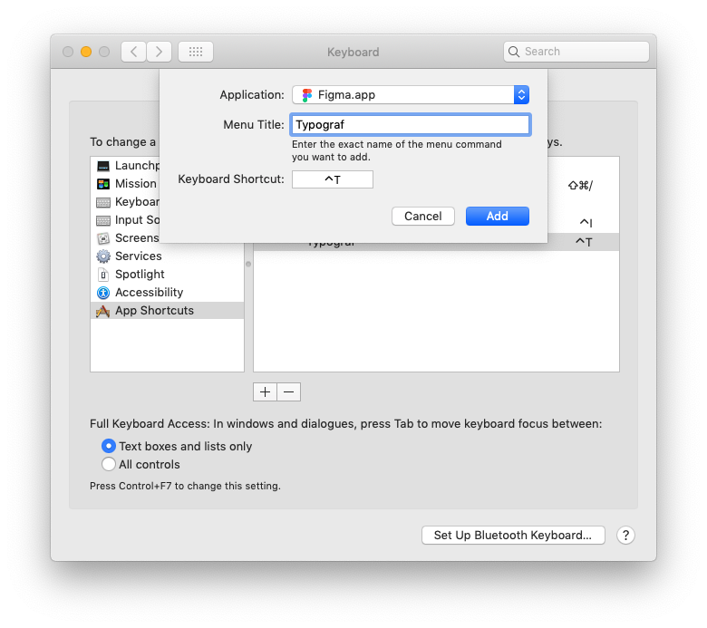

# Typograf Plugin for Figma

[Инструкция на русском 🇷🇺](./docs/readme-RU.md)

Figma plugin for making good typographic text.

* Removes hanging conjunctions.
* Connects the number and the unit with non-breaking space.
* Puts right quotes “outside and ‘inside’ proposals” instead programmers “ " ”.
* Removes double-spaces, double-enters, double-dots.
* Makes ©, ®, ™ from (c), -- turns to — , -> transforms to →, makes ≠ from !=, mm3 turns to mm³.
* Removes spaces at $50 and puts non-breaking spaces at 100 % or 50 €.
* [And more](https://github.com/typograf/typograf/blob/dev/docs/RULES.en-US.md).

It's based on the [Typograf JS](https://github.com/typograf/typograf) library.

If you like this plugin, you could [buy me a coffe](https://rocketbank.ru/aleksandr.golmakov) ☕️


## Install Instructions

[Download the ZIP file](https://github.com/golmakov/figma-typograf-plugin/releases/download/v1.0.1/figma-typograf-plugin.zip) and extract contents.

Open the Figma Desktop, select `Plugins` click `Create your own plugin` -> `Click to choose a manifest.json file` and find the `manifest.json` file in the plugin directory.

### Keyboard Shortcut



If you're using MacOS, you can add custom keyboard shortcut.

1. Open the `System Preferences...` -> `Keyboard` -> `Shortcuts`.
2. Choose `App Shortcuts` and click plus button. 
3. Select Figma from `Applications`, type `Typograf` in the `Menu Title`, select `Keyboard Shortcut` field and press your keayboard shortcut buttons.

I've had hotkey set up as **Ctrl+T**.

## Development

First clone this repository

```bash
git clone https://github.com/golmakov/figma-typograf-plugin.git
cd figma-typograf-plugin
```

Install dependencies & build files

```bash
npm install
npm run dev
```

## To Do

- [ ] Support text layers with mixed style
- [ ] Rules customization


## Author

Aleksander Golmakov ([@golmakov](https://twitter.com/golmakov)) - [golmakov@gmail.com](mailto:golmakov@gmail.com)